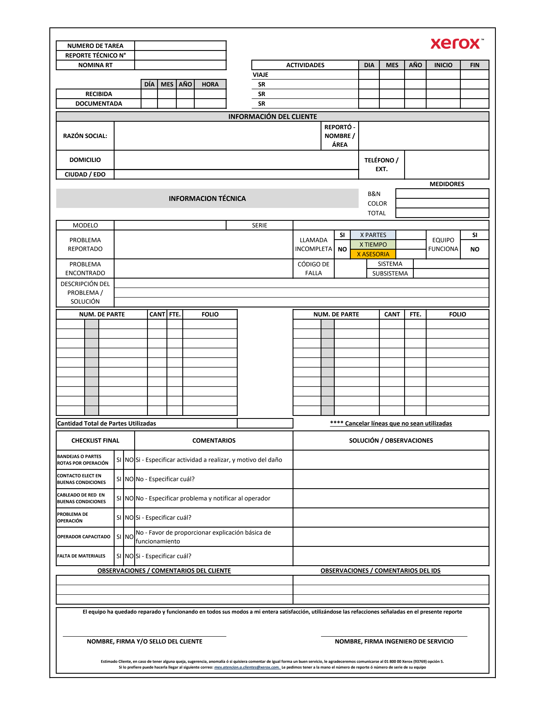

# Reporte Tecnico Xerox (IDS Service)

Aplicacion fullstack para captura de reportes tecnicos en campo.

[](https://github.com/Diamond16-lab/APP__/tree/reporte-tecnico-app)
[](https://github.com/Diamond16-lab/APP__/tree/reporte-tecnico-app)

## Vista General



Este proyecto permite:

- inicio de sesion para tecnicos,
- captura guiada del reporte por pasos,
- calculo automatico de medidores,
- firmas dibujadas de cliente y tecnico,
- guardado real en MongoDB,
- PDF con formato Xerox,
- historial, filtros y comparacion por serie.

## Tecnologias

- Frontend: `React` + `Vite`
- Backend: `Express`
- Base de datos: `MongoDB` + `Mongoose`
- PDF: `jsPDF`

## Requisitos

- `Node.js 20+`
- `MongoDB` accesible por `MONGODB_URI`

## Variables De Entorno

Usa `.env.example` como base:

```bash
MONGODB_URI=mongodb://127.0.0.1:27017/reporte-tecnico
JWT_SECRET=change-this-secret
PORT=4000
SEED_USERNAME=admin
SEED_PASSWORD=Admin123!
SEED_DISPLAY_NAME=Ing. Demo Tecnico
SEED_EMPLOYEE_NUMBER=IDS-001
```

## Instalacion Y Desarrollo

```bash
npm install
npm run dev
```

- Frontend: `http://127.0.0.1:5173`
- API: `http://127.0.0.1:4000`

## Acceso Inicial

Si la coleccion `users` esta vacia, el sistema crea:

- Usuario: `admin`
- Contrasena: `SEED_PASSWORD`

## Deploy Permanente En Render

- [Deploy to Render](https://render.com/deploy?repo=https://github.com/Diamond16-lab/APP__/tree/reporte-tecnico-app)

Secretos requeridos en Render:

- `MONGODB_URI`
- `JWT_SECRET`
- `SEED_PASSWORD`

## Flujo Funcional

1. El tecnico inicia sesion.
2. Captura y valida el reporte.
3. Se guarda en MongoDB.
4. Se genera el PDF desde los datos persistidos.
5. El historial permite filtrar por serie, cliente, razon social, tecnico y fecha.
6. El detalle compara contra el reporte anterior y muestra partes acumuladas.
